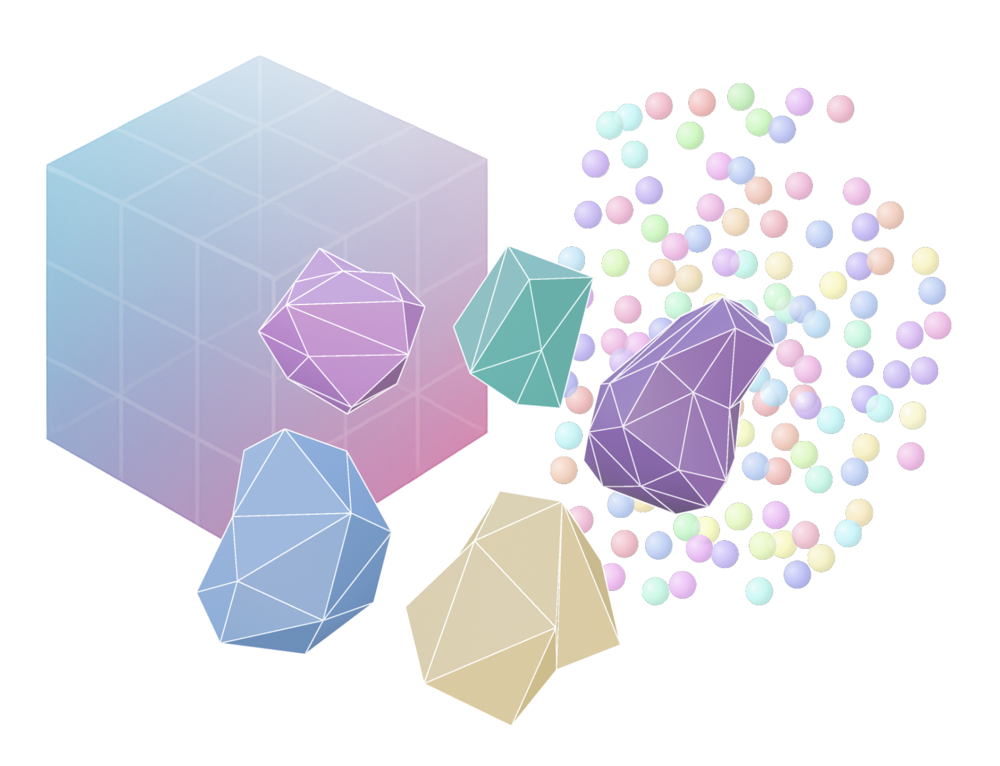

<p align="center">
  
</p>

<h1 align="center">tissue-map-tools</h1>

<p align="center">
  A Python toolkit for scalable 3D spatial biology visualization and analysis<br/>
  <i>Bridges SpatialData and Neuroglancer Precomputed to enable interactive exploration of 3D tissue maps</i>
</p>

<p align="center">
  <a href="https://pypi.org/project/tissue-map-tools/"></a>
  <a href="https://opensource.org/licenses/BSD-3-Clause"></a>
  <a href="https://scverse.zulipchat.com/"></a>
</p>

> **Note:** The library is under active development — breaking changes may occur.

---

## Overview

Biological processes occur in a spatial, three-dimensional context. Yet most spatial biology tools focus on 2D tissue sections, missing critical information about cellular relationships across the third dimension.

**tissue-map-tools** bridges two complementary standards to provide intuitive, scalable 3D workflows:

- [**SpatialData**](https://spatialdata.scverse.org/) — annotated data format for spatial biology (scverse)
- [**Neuroglancer Precomputed**](https://github.com/google/neuroglancer/tree/master/src/datasource/precomputed) — scalable format for large 3D segmentations and point clouds (connectomics)

It enables interactive visualization of 3D images, segmentation masks, meshes, and point clouds via [Neuroglancer](https://neuroglancer-demo.appspot.com/), [napari](https://napari.org/), and [Vitessce](https://vitessce.io/) — all from a single shareable URL.

|                           |                                                                                  |
| ------------------------- | -------------------------------------------------------------------------------- |
| **Fast** ⚡               | Built on OME-NGFF and Neuroglancer Precomputed with adaptive sharding            |
| **Interactive** 🖥️        | Browser-based 3D visualization via Vitessce and Neuroglancer; desktop via napari |
| **Scalable** 📦           | Multi-resolution pyramids and sharded storage for large datasets                 |
| **Adaptive** ⚙️           | Configurable sharding, chunking, spatial indexing, and level-of-detail           |
| **Reproducible** 🔁       | Fully deterministic pipeline                                                     |
| **scverse-integrated** 🧬 | Native SpatialData support                                                       |

---

## Install

```sh
pip install tissue-map-tools
```

Mesh generation from segmentation masks requires `igneous-pipeline` (GPL-3.0 licensed — see [License](#license)):

```sh
pip install tissue-map-tools igneous-pipeline
```

---

## Quick Start

### Convert a segmentation mask → Precomputed volume + meshes

```python
import spatialdata as sd
from tissue_map_tools.igneous_converters import (
    from_spatialdata_raster_to_sharded_precomputed_raster_and_meshes,
)

sdata = sd.read_zarr("my_dataset.zarr")

from_spatialdata_raster_to_sharded_precomputed_raster_and_meshes(
    raster=sdata["cell_labels"],
    precomputed_path="./out/precomputed",
    multiscale=True,
    sharded_raster=True,
    sharded_mesh=True,
    nlod=2,
)
```

### Convert molecular transcripts → Precomputed annotations

```python
from tissue_map_tools.converters import from_spatialdata_points_to_precomputed_points
from tissue_map_tools.data_model.annotations_utils import (
    make_dtypes_compatible_with_precomputed_annotations,
)

points_df = make_dtypes_compatible_with_precomputed_annotations(sdata["molecules"])

from_spatialdata_points_to_precomputed_points(
    points=points_df,
    precomputed_path="./out/precomputed",
    points_name="molecules",
    limit=10000,
    sharded=True,
)
```

### Visualize in Neuroglancer

```python
from tissue_map_tools.view import view_precomputed_in_neuroglancer

viewer = view_precomputed_in_neuroglancer(data_path="./out/precomputed")
print(viewer.get_viewer_url())  # share this URL
```

### Visualize in napari

```python
from tissue_map_tools.view import view_precomputed_in_napari

view_precomputed_in_napari(
    data_path="./out/precomputed",
    show_meshes=True,
    show_points=True,
)
```

---

## Documentation

Full documentation is available in [`docs/index.md`](docs/index.md), including:

- [Architecture overview](docs/index.md#architecture)
- [Full API reference](docs/index.md#api-reference)
- [End-to-end examples](docs/index.md#examples) (MERFISH mouse ileum, CycIF skin cancer)
- [Integration guides](docs/index.md#integration-guide) for SpatialData, Neuroglancer, napari, and Vitessce
- [Configuration reference](docs/index.md#configuration)
- [Shard binary format specification](docs/shard_binary_format.md)

---

## Examples

The `examples/` folder contains complete end-to-end workflows:

| Example                          | Description                                                                |
| -------------------------------- | -------------------------------------------------------------------------- |
| `merfish_mouse_ileum/`           | Full pipeline: raw MERFISH data → SpatialData → Precomputed → Neuroglancer |
| `invasive/`                      | OME-TIFF segmentation → sharded meshes                                     |
| `melanoma/`                      | CycIF skin cancer dataset → sharded meshes                                 |
| `sharded_annotations_example.py` | Standalone point annotation conversion with sharding                       |

---

## License

tissue-map-tools is licensed under the **BSD 3-Clause License**.

The optional `igneous-pipeline` dependency is licensed under **GPL-3.0**. If you use the `igneous_converters` module, your combined work must comply with GPL-3.0. All other functionality (raster conversion, annotations, visualization) is available under BSD 3-Clause without this constraint.

---

## Contact

Feedback and collaborations are very welcome! Please open a [GitHub issue](https://github.com/hms-dbmi/tissue-map-tools/issues) or reach out on [scverse Zulip](https://scverse.zulipchat.com/).

---

## Development

```sh
git clone https://github.com/hms-dbmi/tissue-map-tools
cd tissue-map-tools
uv venv && source .venv/bin/activate
uv sync  # installs examples, dev, and test groups
```

Adding/removing packages:

```sh
uv add <package>
uv remove <package>
uv add --group dev <package>
```

Building for distribution:

```sh
uv build
```

Using pre-commit:

```sh
pre-commit install
pre-commit run --all-files
```
